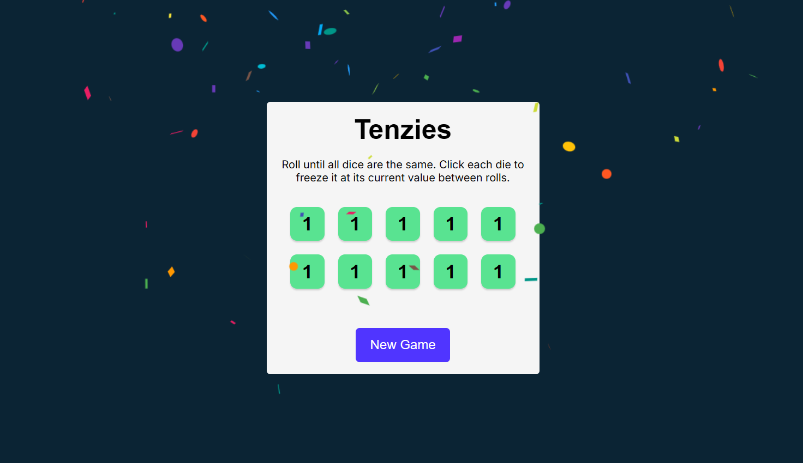

# Tenzies Game

A fun, interactive dice game built using **React**. The objective is to roll the dice until they all show the same value.



## How to Play

1.  **Start:** The game begins with 10 random dice.
2.  **Hold:** Click on a die to "freeze" it at its current value between rolls.
3.  **Roll:** Click the "Roll" button to re-roll the un-held dice.
4.  **Win:** You win when all 10 dice are held and show the same number.

## Key Features

* **State Management:** Tracks the state of ten separate die components (value and held status).
* **Game Loop Logic:** Checks for winning conditions (all held + all matching values) on every update.
* **User Interaction:** Interactive UI allowing users to select/deselect dice.
* **Visual Feedback:** distinct visual styles for held vs. unheld dice.
* **Celebration:** Includes a confetti effect upon winning.

## Tech Stack

* **React:** Functional components, Props, and Hooks (`useState`, `useEffect`).
* **CSS:** Custom styling for grid layout and die faces.
* **Nanoid:** Used for generating unique keys for the dice array.
* **React-Confetti:** For the winning animation.

## Installation & Setup

To run this project locally:

1.  **Clone the repository:**
    ```bash
    git clone [https://github.com/your-username/tenzies-game.git](https://github.com/your-username/tenzies-game.git)
    ```
2.  **Navigate into the directory:**
    ```bash
    cd tenzies-game
    ```
3.  **Install dependencies:**
    ```bash
    npm install
    ```
4.  **Start the development server:**
    ```bash
    npm run dev
    ```
    *(Note: Use `npm start` if you created the app with Create React App)*


